## <ins>Master-Thesis - M.Sc. Computer Science</ins>
### Title: *[Constructing a Knowledge Graph by extracting information from financial news articles](master_thesis/Master_Thesis.pdf?raw=true)*
#### Author: *Rainer Gogel*
#### Index Terms: 
    - Information Extraction
    - Named Entity Recognition
    - Coreference Resolution
    - Topic Modelling
    - Knowledge Graph
    - Large Language Models
    - NLP
    - neo4j

---

### <ins>Background</ins>
This code accompanies my [Master-Thesis](master_thesis/Master_Thesis.pdf?raw=true) (2024) in Computer Science at the 
[Frankfurt University of Applied Sciences](https://www.frankfurt-university.de/en/about-us/faculty-2-computer-science-and-engineering/welcome-to-faculty-2/).   
The [Master-Thesis](https://github.com/rainergo/Fileserver/blob/master/Master_Thesis.pdf?raw=true) was supervised
by [Prof. Dr. Joerg Schaefer](https://www.frankfurt-university.de/de/hochschule/fachbereich-2-informatik-und-ingenieurwissenschaften/kontakt/professorinnen-und-professoren-im-fachbereich-2/jorg-schafer/)
and [Prof. Dr. Baris Sertkaya](https://www.frankfurt-university.de/de/hochschule/fachbereich-2-informatik-und-ingenieurwissenschaften/kontakt/professorinnen-und-professoren-im-fachbereich-2/baris-sertkaya/).

### <ins>Summary</ins>
Reading and understanding news articles takes time and effort and some readers are only interested in information that is relevant to them.  

This Master-Thesis project demonstrates how a user, who is only interested in news about certain companies and topics, can retrieve such  
information from financial news articles in an efficient manner. The project’s code extracts company names and their coreferences from the  
news text, classifies this text into different topic classes and stores this information in a Knowledge Graph. This way, the user can  
retrieve the desired information and discover complex relationships by querying the Knowledge Graph or by communicating with the Knowledge  
Graph’s ChatBot or *Graph Bot*.     

In the *Information Extraction Pipeline* (see Image below), different approaches were studied, implemented in code and compared with each  
other. One of the key findings was that *Generative LLMs* can be used for a wide range of extraction tasks and that these models often  
outperform other, more traditional approaches. Another key finding is that the retrieved information from the *Graph Bot* should also be more  
accurate than answers coming from a typical LLM ChatBot, even if that LLM ChatBot has a traditional RAG system attached to it.  

This is because the Graph Bot’s response is more based and focused on the stored news articles in the Knowledge Graph and less on next-word  
probabilities and vector similarities. Such a Knowledge Graph can be seen as an alternative RAG system that might replace the more commonly  
used vector databases there.  This is supported by a recently published and influential research paper by [Microsoft](https://arxiv.org/pdf/2404.16130) that points in the same   
direction.

<figure>
  <h3>Information Extraction Pipeline</h3>
  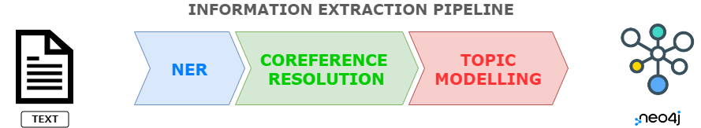
</figure>

<figure>
  <h3>Knowledge Graph Schema</h3>
  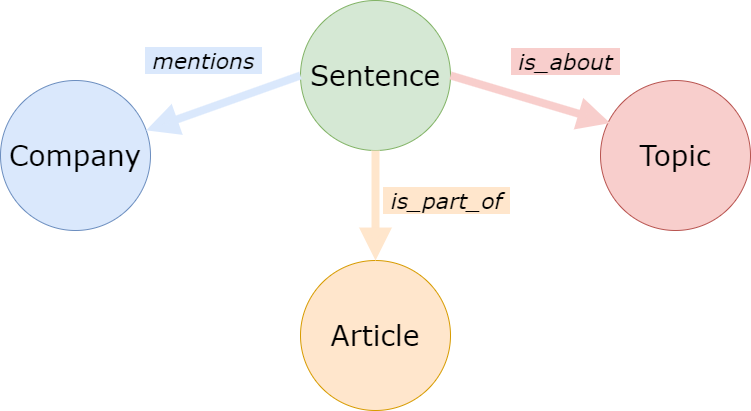
</figure>

---

### <ins>Setup</ins>
Prerequisites for running the Jupyter Notebook **"MAIN.ipynb"**:

1. Install neo4j on your machine: [Installation Instructions](https://neo4j.com/docs/operations-manual/current/installation/)
2. Install the Python libraries from the [Pipfile](Pipfile)
3. Change the filename of the [secrets_copy.env](secrets_copy.env) file to **secrets.env** and there insert your 
   - neo4j username (see 1.)
   - neo4j password (see 1.)
   - OpenAI api key

4. Run the Jupyter Notebook **"MAIN.ipynb"** or sections thereof.

---

### <ins>MAIN.ipynb</ins>
All functionalities of the Python code can be run in the condensed Jupyter Notebook **"MAIN.ipynb"**.  
This Notebook comprises the following sections:

<figure>
<h4>STEP 1: Import libraries</h4>
  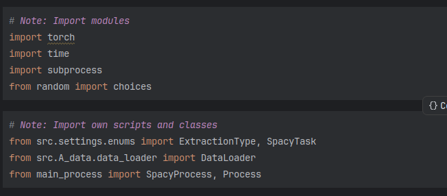
</figure>
<figure>
<h4>STEP 2: Start Docker container (required)</h4>
  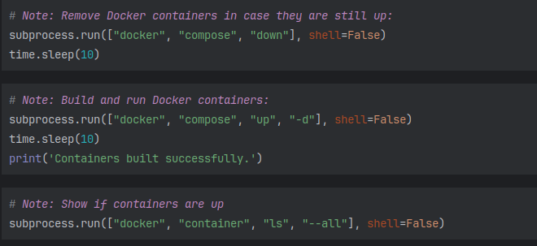
<figcaption>The Docker images will be downloaded from my GitHub container registry: ghcr.io/rainergo</figcaption>
</figure>
 
<figure>
<h4>STEP 3: Load News Articles (see section "Data" below)</h4>
  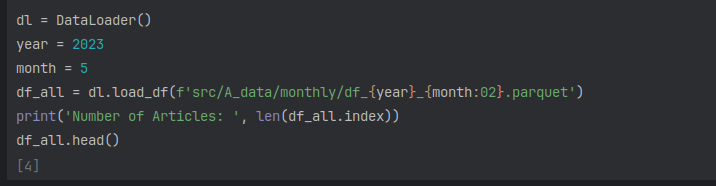
</figure>
<figure>
<h4>STEP 4: Run spacy pipeline (NER, Coreference Resolution)</h4>
  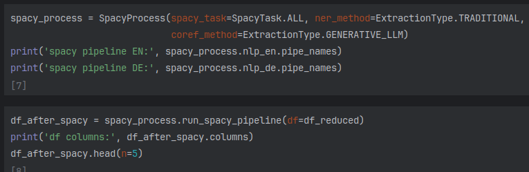
</figure>
<figure>
<h4>STEP 5: Convert Nested Dictionary</h4>
  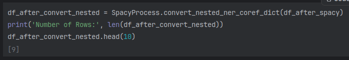
</figure>
<figure>
<h4>STEP 6: Start Topic Modelling Process</h4>
  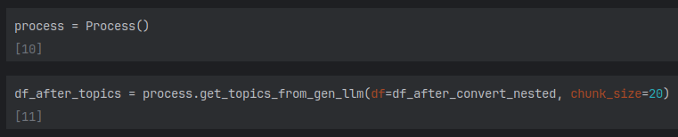
</figure>
<figure>
<h4>STEP 7: Prepare DataFrame for Knowledge Graph</h4>
  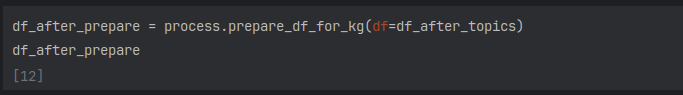
</figure>
<figure>
<h4>STEP 8: Initialize Knowledge Graph and load Data</h4>
  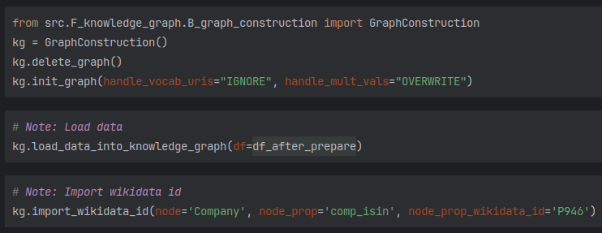
</figure>
<figure>
<h4>STEP 9: Enrich Knowledge Graph with Data from Wikidata</h4>
  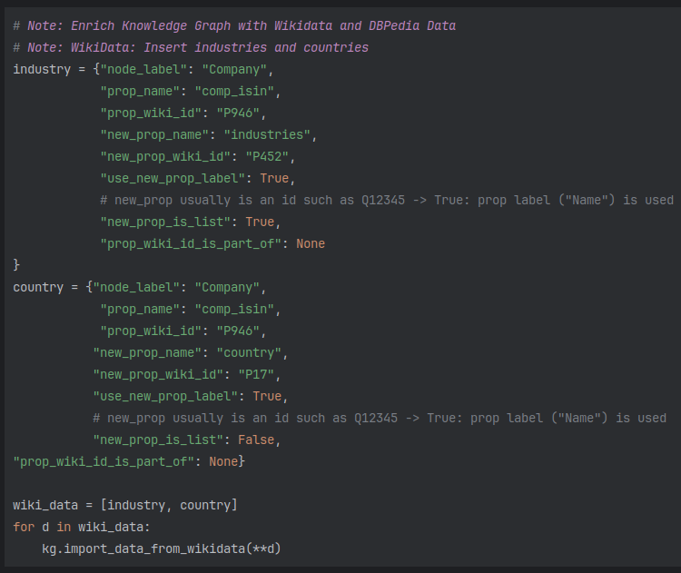
</figure>
<figure>
<h4>STEP 10: Enrich Knowledge Graph with Data from DBPedia</h4>
  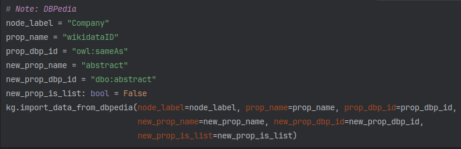
</figure>
<figure>
<h4>STEP 11: Create Sentence Text Embeddings</h4>
  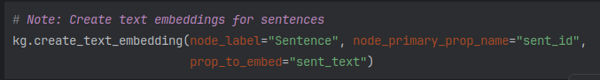
</figure>
<figure>
<h4>STEP 12: Communicate with Graph Bot</h4>
  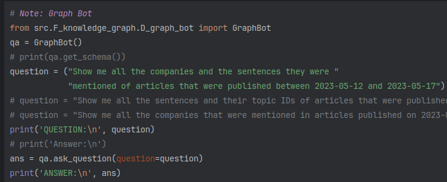
</figure>

Please find further information to this in the code sections and in the [Master-Thesis](master_thesis/Master_Thesis.pdf?raw=true).    

---

### <ins>Data</ins>
Data can be found in the folder: /src/A_data/monthly/*

The data was scraped from the websites of [EQS-News](https://www.eqs-news.com) and [dpa-AFX](https://mobile.traderfox.com/news/dpa-compact/), both business news hubs that aggregate multiple news sources.   
The text in the html-files were converted to text files, cleaned and read into pandas DataFrames.   
The daily data was aggregated on a monthly basis and the pandas DataFrames were stored as Apache parquet files.   
These files can be found in the */src/A_data/monthly* directory.   

<figure>
<h4>pandas DataFrame</h4>
  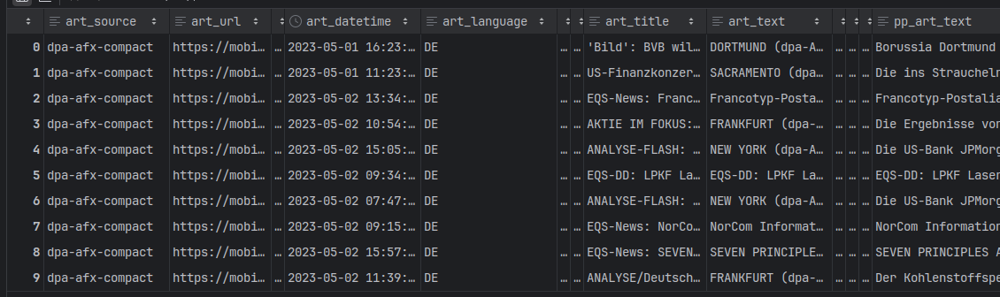
</figure>

The type of the news articles includes *ad-hoc news*, *press releases*, *corporate news* and *regulatory filings*.   
These could be published by *companies* themselves or *media outlets* such as *newspapers*, *news agencies* or other *broadcasters*.   
Of the news articles, the article text, the article title and some other metadata such as publication dates, authors, etc. (see image above)  
were scraped.

Please find further information to this in the code sections and in the [Master-Thesis](master_thesis/Master_Thesis.pdf?raw=true).    

---
### Copyright: MIT License
Copyright (c) 2024 Rainer Gogel

Permission is hereby granted, free of charge, to any person obtaining a copy of this software and associated documentation files (the "Software"), to deal in the Software without restriction, including without limitation the rights to use, copy, modify, merge, publish, distribute, sublicense, and/or sell copies of the Software, and to permit persons to whom the Software is furnished to do so, subject to the following conditions:

The above copyright notice and this permission notice shall be included in all copies or substantial portions of the Software.

THE SOFTWARE IS PROVIDED "AS IS", WITHOUT WARRANTY OF ANY KIND, EXPRESS OR IMPLIED, INCLUDING BUT NOT LIMITED TO THE WARRANTIES OF MERCHANTABILITY, FITNESS FOR A PARTICULAR PURPOSE AND NONINFRINGEMENT. IN NO EVENT SHALL THE AUTHORS OR COPYRIGHT HOLDERS BE LIABLE FOR ANY CLAIM, DAMAGES OR OTHER LIABILITY, WHETHER IN AN ACTION OF CONTRACT, TORT OR OTHERWISE, ARISING FROM, OUT OF OR IN CONNECTION WITH THE SOFTWARE OR THE USE OR OTHER DEALINGS IN THE SOFTWARE.

---